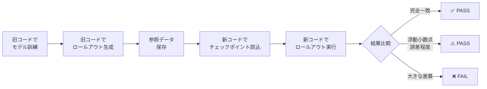

# 等価性テスト概要

リファクタリング後のコードが元のコードと機能的に等価であることを検証する方針の概要です。

## テストの目的

リファクタリングによってコードの構造は変更されましたが、以下が保持されていることを確認します：

1. **チェックポイント互換性**: 旧コードで訓練したモデルが読み込める
2. **推論の決定性**: 同じモデル・同じ入力で同じ予測結果が得られる
3. **訓練の妥当性**: 訓練が正常に動作し、lossが減少する
4. **設定の互換性**: メタデータから正しく設定が復元される

## 重要な前提：乱数制御なし

現在のコードには乱数シード制御機能がありません。

- **訓練時**: `torch.randn()`でノイズ付加 → **非決定論的**
- **推論時（ロールアウト）**: ノイズなし → **決定論的**

そのため：
- ✅ **推論は完全一致を期待**できる
- ❌ **訓練の厳密な再現は期待しない**（loss減少のみ確認）

## テスト戦略

### テスト環境の配置

```
repos/gns/
├── main/              # 旧コード（参照のみ）
├── wt-cleanup/        # 新コード（参照のみ）
└── equivalence-tests/ # ★テスト実行環境★（リポジトリ外）
    ├── test_data/
    │   ├── WaterDropSample/     # テストデータ
    │   └── old_results/         # 旧コード実行結果
    └── tests/
        └── test_equivalence.py  # テストコード
```

**なぜリポジトリ外？**
- リポジトリが汚れない（`test_data/`, `tests/`不要）
- 新旧コードを対等に扱える
- クリーンな環境で厳密なテスト

### テストの流れ



### 合否判定

| 結果 | 判定 | 意味 |
|------|------|------|
| **完全一致** | ✅ PASS | リファクタリング成功 |
| **浮動小数点誤差程度**<br/>(rtol=1e-6, atol=1e-7) | ⚠️ PASS | 許容範囲（演算順序の違いなど） |
| **大きな差異** | ❌ FAIL | リファクタリングにバグあり |

## テストコードの要点

### 1. 参照データ生成（旧コードで実行）

```bash
# 旧コードで10ステップ訓練
python ../main/gns/train.py --mode=train --ntraining_steps=10 ...

# 旧コードでロールアウト生成
python ../main/gns/train.py --mode=rollout ...
```

**重要**: 旧コードは`absl.app`を使用 → CLI実行のみ可能

### 2. 等価性テスト（新コードで実行）

```python
# 旧コードの出力を読み込み
reference_rollout = pickle.load("old_results/rollout/rollout_ex0.pkl")

# 新コードで同じチェックポイントを使ってロールアウト
simulator.load_state_dict(old_checkpoint)
predicted_rollout = rollout.rollout(simulator, ...)

# 比較（決定論的推論のため完全一致期待）
np.testing.assert_array_equal(predicted_rollout, reference_rollout)
```

### 3. 訓練妥当性テスト（新コードのみ）

```python
# 50ステップ訓練してloss減少を確認
early_loss = mean(losses[:10])
late_loss = mean(losses[-10:])
assert late_loss < early_loss  # 減少すればOK
```

**注意**: 厳密な再現性は期待しない（乱数制御なし）

## 実装上の注意点

### 旧コードの制約

- `absl.app`を使用 → `main()`関数を直接呼び出せない
- CLI経由での実行が必須

### 新コードのAPI

```python
# rollout関数のシグネチャ
_, predicted = rollout.rollout(
    simulator=simulator,
    position=position_seq,           # 初期位置
    particle_types=particle_types,   # 粒子タイプ
    material_property=mat_prop,      # 材料特性
    n_particles_per_example=n_particles,
    nsteps=nsteps,
    simulator_config=config,         # 設定
    device=device
)
```

### ファイル名の注意

- 旧コード: `rollout_ex0.pkl` (output_filename + "_ex" + example_i)
- 新コード: 任意に設定可能

## まとめ

- **テスト環境**: リポジトリ外の独立した環境で実行
- **推論テスト**: 決定論的 → 完全一致を期待
- **訓練テスト**: 非決定論的 → loss減少のみ確認
- **判定基準**: 明確（完全一致 or 浮動小数点誤差 or 失敗）

詳細は [equivalence-testing-plan.md](./equivalence-testing-plan.md) を参照してください。
