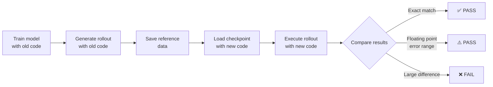

# Equivalence Testing Overview

This document outlines the strategy for verifying that refactored code is functionally equivalent to the original code.

## Testing Objectives

While refactoring changed the code structure, we need to confirm that the following are preserved:

1. **Checkpoint Compatibility**: Models trained with old code can be loaded
2. **Inference Determinism**: Same model and input produce same predictions
3. **Training Validity**: Training works correctly and loss decreases
4. **Configuration Compatibility**: Configuration is correctly restored from metadata

## Important Assumption: No Random Seed Control

The current code does not have random seed control functionality.

- **During Training**: Noise is added using `torch.randn()` → **Non-deterministic**
- **During Inference (Rollout)**: No noise → **Deterministic**

Therefore:
- ✅ **Inference can be expected to match exactly**
- ❌ **Exact training reproduction is not expected** (only verify loss decrease)

## Testing Strategy

### Test Environment Layout

```
repos/gns/
├── main/              # Old code (reference only)
├── wt-cleanup/        # New code (reference only)
└── equivalence-tests/ # ★ Test execution environment ★ (outside repository)
    ├── test_data/
    │   ├── WaterDropSample/     # Test data
    │   └── old_results/         # Old code execution results
    └── tests/
        └── test_equivalence.py  # Test code
```

**Why outside repository?**
- Keeps repository clean (no `test_data/`, `tests/` needed)
- Treats old and new code equally
- Strict testing in clean environment

### Testing Flow



### Pass/Fail Criteria

| Result | Verdict | Meaning |
|--------|---------|---------|
| **Exact match** | ✅ PASS | Refactoring successful |
| **Floating point error range**<br/>(rtol=1e-6, atol=1e-7) | ⚠️ PASS | Acceptable (different operation order, etc.) |
| **Large difference** | ❌ FAIL | Refactoring has bugs |

## Key Points in Test Code

### 1. Generate Reference Data (Execute with old code)

```bash
# Train 10 steps with old code
python ../main/gns/train.py --mode=train --ntraining_steps=10 ...

# Generate rollout with old code
python ../main/gns/train.py --mode=rollout ...
```

**Important**: Old code uses `absl.app` → CLI execution only

### 2. Equivalence Test (Execute with new code)

```python
# Load old code output
reference_rollout = pickle.load("old_results/rollout/rollout_ex0.pkl")

# Run rollout with new code using same checkpoint
simulator.load_state_dict(old_checkpoint)
predicted_rollout = rollout.rollout(simulator, ...)

# Compare (expect exact match for deterministic inference)
np.testing.assert_array_equal(predicted_rollout, reference_rollout)
```

### 3. Training Validity Test (New code only)

```python
# Train 50 steps and verify loss decreases
early_loss = mean(losses[:10])
late_loss = mean(losses[-10:])
assert late_loss < early_loss  # Decrease is OK
```

**Note**: Exact reproducibility is not expected (no random control)

## Implementation Notes

### Old Code Constraints

- Uses `absl.app` → Cannot call `main()` function directly
- Must execute via CLI

### New Code API

```python
# rollout function signature
_, predicted = rollout.rollout(
    simulator=simulator,
    position=position_seq,           # Initial positions
    particle_types=particle_types,   # Particle types
    material_property=mat_prop,      # Material properties
    n_particles_per_example=n_particles,
    nsteps=nsteps,
    simulator_config=config,         # Configuration
    device=device
)
```

### Filename Notes

- Old code: `rollout_ex0.pkl` (output_filename + "_ex" + example_i)
- New code: Can be set arbitrarily

## Summary

- **Test Environment**: Execute in independent environment outside repository
- **Inference Test**: Deterministic → expect exact match
- **Training Test**: Non-deterministic → verify loss decrease only
- **Criteria**: Clear (exact match or floating point error or failure)

For details, see [equivalence-testing-plan.md](./equivalence-testing-plan.md).
