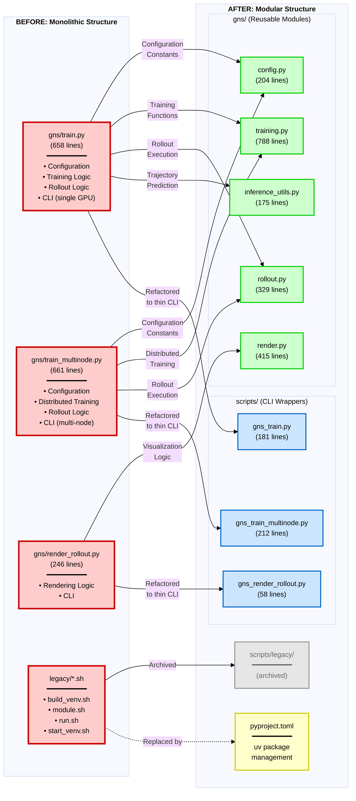

# GNS Codebase Structure Migration

このドキュメントは、リファクタリングによって役割がどのように再配置されたかを示します。

## 二部グラフ: ファイル構造の移行

**凡例:**
- 🔴 **赤**: リファクタリング前の実行スクリプト（gns/内に配置、ビジネスロジックとCLIが混在）
- 🟢 **緑**: リファクタリング後の再利用可能モジュール (gns/)
- 🔵 **青**: リファクタリング後のCLIラッパー (scripts/)
- 🟡 **黄**: 新しいパッケージ管理システム
- ⚫ **灰**: アーカイブされたファイル

**主な変更:**
- **実行スクリプト**: `gns/train.py` (658行) + `gns/train_multinode.py` (661行) + `gns/render_rollout.py` (246行) → ロジックをモジュール化 + 薄いCLIラッパー (scripts/: 181, 212, 58行)

## 主要な変更点

### 分離された責務

1. **Configuration** (gns/train.py, gns/train_multinode.py → gns/config.py)
   - 重複していたグローバル定数を統一された設定クラスに変換

2. **Training** (gns/train.py, gns/train_multinode.py → gns/training.py)
   - トレーニングループとユーティリティ
   - 単一GPU/分散訓練の共通ロジック抽出
   - データローダー管理
   - チェックポイント管理

3. **Rollout/Inference** (gns/train.py, gns/train_multinode.py → gns/rollout.py + gns/inference_utils.py)
   - ロールアウト実行ロジックの共通化
   - 軌道予測ユーティリティの分離

4. **Rendering** (gns/render_rollout.py → gns/render.py)
   - 可視化ロジックとCLIの分離
   - GIF、VTK、画像レンダリング機能

5. **CLI** (gns/*.py → scripts/*.py)
   - 薄いCLIラッパー（56-250行）
   - ビジネスロジックを上記モジュールに委譲
   - gns/ディレクトリからscripts/ディレクトリへ移動

6. **Environment** (legacy/*.sh → pyproject.toml)
   - uvによるモダンなパッケージ管理
