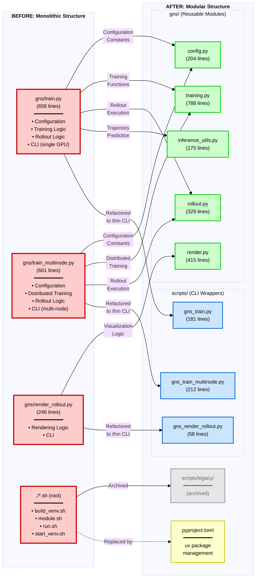

# GNS Codebase Structure Migration

This document illustrates how responsibilities were reorganized through refactoring.

## Bipartite Graph: File Structure Migration

**Legend:**
- 🔴 **Red**: Pre-refactoring execution scripts (located in gns/, mixed business logic and CLI)
- 🟢 **Green**: Post-refactoring reusable modules (gns/)
- 🔵 **Blue**: Post-refactoring CLI wrappers (scripts/)
- 🟡 **Yellow**: New package management system
- ⚫ **Gray**: Archived files

**Key Changes:**
- **Execution scripts**: `gns/train.py` (658 lines) + `gns/train_multinode.py` (661 lines) + `gns/render_rollout.py` (246 lines) → Modularized logic + thin CLI wrappers (scripts/: 181, 212, 58 lines)

## Major Changes

### Separated Responsibilities

1. **Configuration** (gns/train.py, gns/train_multinode.py → gns/config.py)
   - Unified duplicated global constants into a configuration class

2. **Training** (gns/train.py, gns/train_multinode.py → gns/training.py)
   - Training loop and utilities
   - Extracted common logic for single-GPU/distributed training
   - Dataloader management
   - Checkpoint management

3. **Rollout/Inference** (gns/train.py, gns/train_multinode.py → gns/rollout.py + gns/inference_utils.py)
   - Unified rollout execution logic
   - Separated trajectory prediction utilities

4. **Rendering** (gns/render_rollout.py → gns/render.py)
   - Separated visualization logic from CLI
   - GIF, VTK, and image rendering functionality

5. **CLI** (gns/*.py → scripts/*.py)
   - Thin CLI wrappers (56-250 lines)
   - Delegate business logic to above modules
   - Moved from gns/ directory to scripts/ directory

6. **Environment** (./*.sh → pyproject.toml)
   - Modern package management with uv
